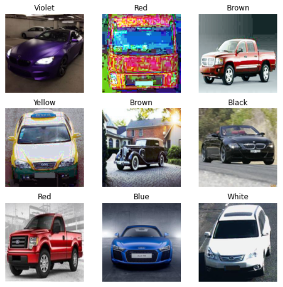

# RuCode 2022 (5-th place)

Решение основной задачи "Определение цвета автомобиля" трека искусственный интеллект фестиваля [RuCode](https://rucode.net/) 2022.

Приватный лидерборд (rucode6user-0030, f1-score = 0.9856)  |
:----------------------------------------------------------|
                                   |

---
Ноутбук: https://www.kaggle.com/code/markovka/rucode-2022

Датасет: https://www.kaggle.com/datasets/markovka/car-dataset

Веса модели: https://www.kaggle.com/datasets/markovka/final-model

---


## Данные
Тренировочные и тестовые данные представляют собой картинки различных автомобилей 7 цветов:
Черный (Black), Синий (Blue), Коричневый (Brown), Голубой (Cyan), Зеленый (Green), Серый (Gray), 
Оранжевый (Orange), Красный (Red), Фиолетовый (Violet), Белый (White), Желтый (Yellow).


## Предобработка данных
Во время обучения данные предобрабатывались с помощью различных аугментаций таких, как [random rotation](https://pytorch.org/vision/main/generated/torchvision.transforms.RandomRotation.html), [random perspective](https://pytorch.org/vision/main/generated/torchvision.transforms.RandomPerspective.html), [random posterize](https://pytorch.org/vision/stable//generated/torchvision.transforms.v2.RandomPosterize.html), [random equalize](https://pytorch.org/vision/stable//generated/torchvision.transforms.v2.RandomEqualize.html).
Из них для обучения итоговой модели была оставлена только <u>random equalize</u>.



Затем данные нормализовались со значениями среднего ```mean = [0.485, 0.456, 0.406]``` и стандартного отклонения ```std = [0.229, 0.224, 0.225]```. Для всей предобработки данных использовался модуль ```torchvision.transforms```.

## Модель и обучение
Для классификации использовалась модель [ResNet101 V1](https://pytorch.org/vision/stable//models/generated/torchvision.models.resnet101.html) из ```torchvision.models```.

При обучении у модели были разморежены последние два слоя (layer3 и layer4).
Так же использовался оптимизатор [Adam](https://pytorch.org/docs/stable/generated/torch.optim.Adam.html) и функция потерь [CrossEntropy](https://pytorch.org/docs/stable/generated/torch.nn.CrossEntropyLoss.html), для шедулинга lr использовался [StepLR](https://pytorch.org/docs/stable/generated/torch.optim.lr_scheduler.StepLR.html) scheduler. При обучении целью было получить максимальное значение метрики [f1-score](https://scikit-learn.org/stable/modules/generated/sklearn.metrics.f1_score.html).


Модель обучалась на [Kaggle](https://www.kaggle.com/) с использованием GPU P100.
